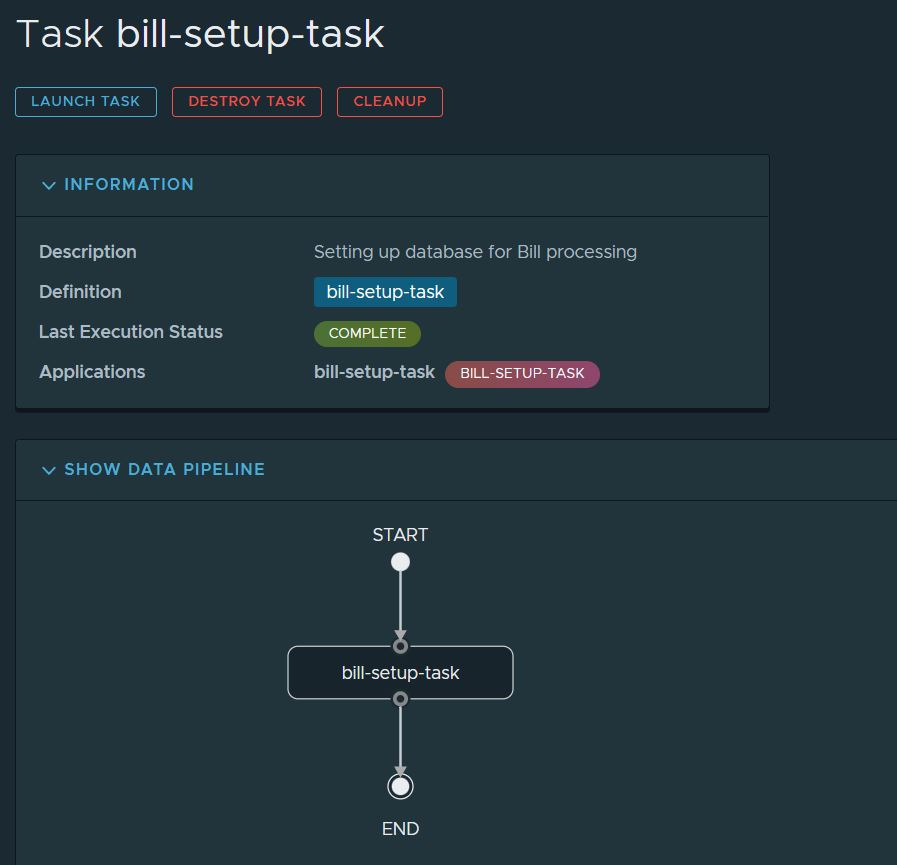

## Defintion of porject
This project demostrates the basic concept of Spring Cloud Task framework. This project also structures the fundamental implementation for another quite broad project.

## Objective
<li>To demonstarte the Spring Cloud Task </li>
<li>To get familiarize with Cloud Tasks </li>
<li>Basic understanding of the Spring Cloud DataFlow Server</li>

## **How to run this project**
<li>Spring cloud and cloud dataflow server initializes a quite good number of Metadata Tables. For this project I have executed the below script directly copied from the github repository of Spring Cloud .</li>

> Link for schemas: [Task Schemas](https://github.com/spring-cloud/spring-cloud-dataflow/tree/main/spring-cloud-dataflow-server-core/src/main/resources/schemas)

<ol>
<li> To run the project clone this project and import this in eclipse.
<li>Establish connection with MySQL server.
<li> Execute all the scripts the skippers are not required though but considering any future scope execute the scripts for the Skipper Server.
<li> This project can be executed in two ways:
<ol>
<li>Using the eclipse/Maven command.
Maven command to execute: clean compile -DskipTests=true package install spring-boot:run
<li>Using the spring cloud dataflow server see below
</ol>
<li> Check the log files and the database a table named "Bill_STATEMENTS" will be created with a single entry.
</ol>

## **Execution in Spring Cloud DataFlow server**
### _Deployer configurations_:
deployer.bill-setup-task.spring.cloud.dataflow.features.streams-enabled=false
deployer.bill-setup-task.spring.cloud.dataflow.features.schedules-enabled=false
deployer.bill-setup-task.spring.cloud.dataflow.features.tasks-enabled=true
deployer.bill-setup-task.cpu=1
deployer.bill-setup-task.disk=100
deployer.bill-setup-task.local.working-directories-root=D:\Program Files\Spring\Spring Data Flow
deployer.bill-setup-task.memory=100
spring.cloud.dataflow.task.platformName=default

### _Running the Server_:
<li>Execute the below script in CMD. The Bash script will be similar something like this. Please follow the 'export' to set the environment variable.</li>
 @echo off
timeout 3 > nul

set PATH=.;C:\Program Files\Java\Jdk1.8\jdk1.8.0_281\bin
echo "Setting necessary environment varibales===================>"

set SPRING_CLOUD_DATAFLOW_FEATURES_STREAMS_ENABLED=false
set SPRING_CLOUD_DATAFLOW_FEATURES_SCHEDULES_ENABLED=false
set SPRING_CLOUD_DATAFLOW_FEATURES_TASKS_ENABLED=true
set spring_datasource_url=jdbc:mariadb://localhost:3306/CYOLASBCOM
set spring_datasource_username=Soumya
set spring_datasource_password=system
set spring_datasource_driverClassName=org.mariadb.jdbc.Driver
set spring_datasource_initialization_mode=always
set spring_flyway_enabled=false

timeout 3 > nul

start java -jar spring-cloud-dataflow-server-2.10.0.jar

> To download the jar Maven Central can be used

<li> 
launch the [DataFlow Server](http://localhost:9393/dashboard/)</li>

>**Follow further steps from here**: [Reference Document](https://dataflow.spring.io/docs/batch-developer-guides/)
and [Spring Cloud Task](https://docs.spring.io/spring-cloud-task/docs/2.4.5/reference/html/)

